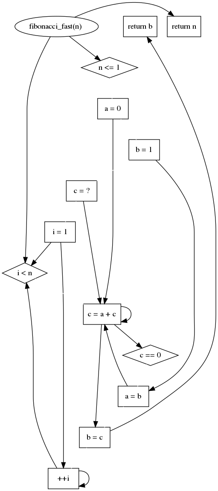

# Data Dependency Graph
This repository showcases the results of a lab project where C++ Abstract Syntax Trees (ASTs) were parsed and processed using Python to draw Data Dependency Graphs. The graphs depict the relationships and dependencies between variables and expressions within the C++ code, providing valuable insights into the data flow and interactions.

pycparser was used to get the AST
graphviz for drawing DDG

Example of generated DDG for tests/fibonacci.cpp:

